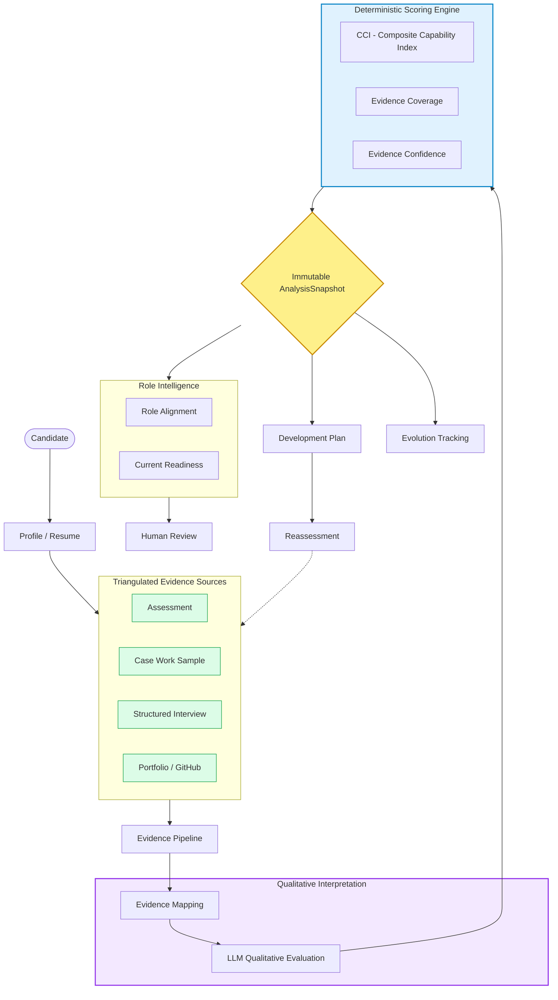

# METI Architecture

The following diagram illustrates the core data flow, evidence triangulation, and deterministic scoring pipeline within the METI platform. 

It highlights the boundary between qualitative LLM interpretation and the strict, immutable deterministic Python engine.

## Immutable Audit Boundary

The `AnalysisSnapshot` represents the core audit boundary in the system. 
- **Before the snapshot:** Evidence is gathered, synthesized, and interpreted.
- **After the snapshot:** The state of the candidate's capability at that exact moment is frozen. Any future human reviews, development plans, or role alignments strictly reference this immutable ID. New evidence triggers a completely new snapshot, allowing accurate evolution tracking over time.
